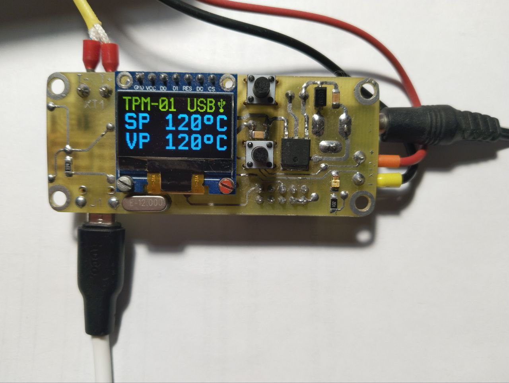

# Температурный ПИД-регулятор TRM-1

Рисунок 1 - Внешний вид устройства

Устройство предназначено для поддержания температуры нагревательного прибора.
ПИД-регулятор поддерживает температуру нагревателя за счет изменения длительности
импульса питающего напряжения. В качестве температурного датчика используется 
термопара типа "K". Устройство построено на микроконтроллере ATmega16 и 
конфигурируется с помощью ПК.
Для реализации связи устройства использованы сторонние библиотеки: usblib-1.0 и
библиотека v-usb (с некоторыми изменениями для сборки компилятором avr gcc C++).
Программное обеспечение для ПК разрабатывалось с использованием:
- операционной системой Linux Astra Common Edition 2.12.46;
- кроссплатформенный фреймворк Qt Creator 4.12.3, входящий в стандартный комплект 
  установки Linux Astra;
- библиотека usblib-1.0-0 и пакет разработки для данной библиотеки usblib-1.0-0-dev, 
  а также пакет справочной информации usblib-1.0-0-doc.

Рисунок 2 - Внешний вид программы для ПК

